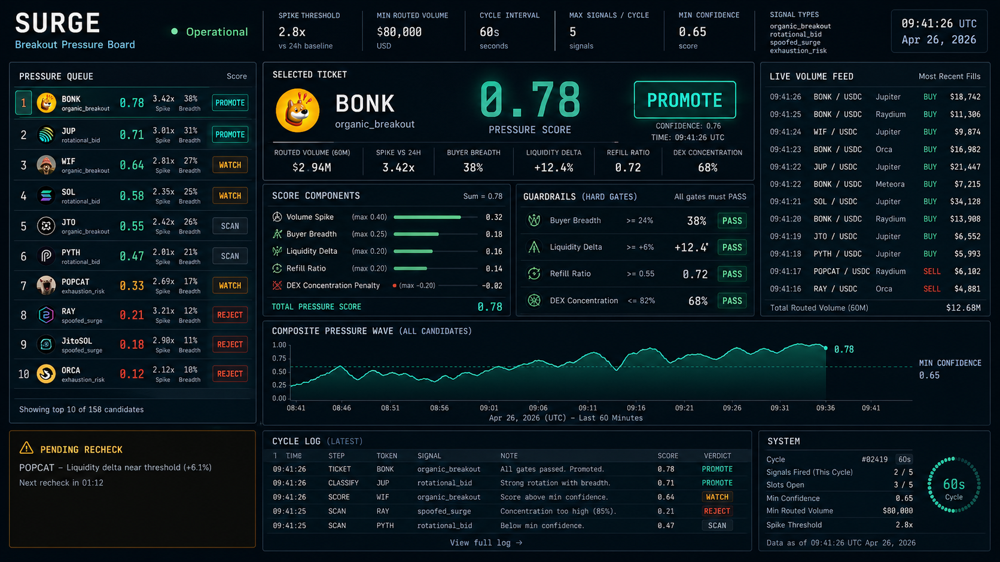
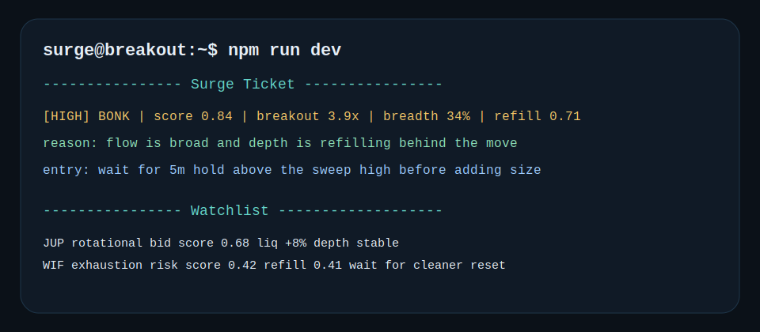

# Surge

Breakout-pressure engine for Solana tokens.

Find the Solana breakouts that still look tradable after the first sweep.

`bun run dev`

- watches buyer breadth, liquidity migration, refill quality, and venue concentration
- ignores one-wallet spikes and thin one-venue squeezes
- promotes setups that still have exitable depth after the initial burst

[](https://github.com/SurgeDetect/Surge/actions)


Live Breakout Pressure Board • Live Ticket • Operating Surfaces • Why Surge Exists • Signal Ladder • Technical Spec • Quick Start

## At a Glance

- `Use case`: short-horizon breakout filtering for Solana tokens
- `Primary input`: buyer breadth, liquidity migration, refill behavior
- `Primary failure mode`: optical spikes that become untradeable after the first sweep
- `Best for`: operators who need to know whether a move can still be exited cleanly

## Live Breakout Pressure Board



Live operating view for Surge: ranked candidate queue, Jupiter routed-volume feed, selected ticket with score components and four gates, composite pressure wave, and the agent's current PROMOTE, WATCH, SCAN, or REJECT decision.

## Live Ticket



## Operating Surfaces

- `Breakout Board`: ranks candidates by pressure quality instead of raw volume
- `Flow Components`: exposes the inputs driving the breakout score
- `Cycle Log`: shows why a name stayed eligible, moved to watch, or fell out
- `Terminal Ticket`: prints the exact setup the operator sees in the scan

## What Surge Is Actually Trying To Solve

The average breakout scanner is too easy to fool. One wallet can force a candle, one venue can print a dramatic move, and social traders will still treat it as a "signal" because the chart looks urgent.

Surge is intentionally stricter than that. It assumes a move is fake until breadth, refill behavior, and exitable depth say otherwise. The point is not to catch every spike. The point is to keep attention on the spikes that still look tradeable after the first round of chasing is over.

## Why Surge Exists

Most meme scanners fire on raw volume. That is the easy part. The useful distinction is whether the spike is broad enough and liquid enough to keep moving after the first burst.

Surge ranks each candidate with a continuation model:

`breakoutScore = 0.34 * spike + 0.24 * breadth + 0.22 * liquidity + 0.20 * refill - 0.18 * concentrationPenalty`

Signals are rejected when any of these fail:
- `buyerBreadthPct < MIN_BUYER_BREADTH_PCT`
- `liquidityDeltaPct < MIN_LIQUIDITY_DELTA_PCT`
- `refillRatio < MIN_REFILL_RATIO`
- `dexDominancePct > MAX_DEX_DOMINANCE_PCT`

## What Surge Looks For

The strongest Surge setup does not just print volume. It broadens. You want fresh takers, a book that keeps refilling, and enough depth growth that the move still looks tradeable after the first chase candle.

That is why Surge cares about participation quality more than dramatic candles. A break that only lives on one venue or one wallet cluster is usually too fragile to promote.

## Signal Ladder

Surge pushes names through four practical states:

- `scan`: the name is active, but the move still needs confirmation
- `watch`: the move is real enough to track, but one component is still weak
- `promote`: breadth, refill, and depth all support continuation
- `reject`: the move is too concentrated, too thin, or too late

The operator is supposed to see where the move is failing, not just whether the score is high.

## How It Works

Surge follows a narrow sequence on every cycle:

1. collect fresh routed volume from the monitored Solana pairs
2. compare current flow against the rolling baseline
3. test whether the move is broadening across buyers instead of concentrating
4. check whether top-of-book depth and refill quality still support continuation
5. rank the survivors and print the names worth watching

The model is intentionally front-loaded with rejection logic. Most spikes should die before they become a terminal ticket.

## How A Real Scan Cycle Reads

A good Surge cycle usually feels boring before it feels exciting.

1. Volume expansion starts to appear on one or two Solana venues.
2. Surge checks whether that flow is broadening across more buyers instead of concentrating.
3. The board looks for depth growth and refill behavior after the first sweep.
4. Only after those pieces line up does the candidate move from scan to watch or promote.

That is why the board is useful during noisy meme conditions. It gives a structured reason to stay patient.

## What Generic Spike Scanners Miss

- they overvalue raw notional without checking who is actually buying
- they promote thin books where exiting becomes the real problem
- they fail to distinguish rotational flow from broad breakout participation
- they reward dramatic candles even when one venue is doing all the work

Surge is designed specifically to remove those false positives.

## Example Output

```text
SURGE // BREAKOUT PRESSURE TICKET

[PROMOTE] BONK
pressure score     0.84
buyer breadth      34%
liq delta          +10%
refill ratio       0.71
dex concentration  60%

operator note: breadth is broad enough and refill held after the first sweep
```

## Technical Spec

### Inputs

- `spikeRatio`: current routed volume divided by the rolling baseline
- `buyerBreadthPct`: share of buying flow coming from many small and medium takers instead of one pocket
- `liquidityDeltaPct`: change in exitable top-of-book depth during the move
- `refillRatio`: how much of the consumed book refills after each sweep
- `dexDominancePct`: how concentrated the move is on a single venue

### Design Rationale

- High `spikeRatio` without breadth is usually a one-pocket move.
- Positive `liquidityDeltaPct` means the market is still willing to make the pair.
- Strong `refillRatio` reduces late-entry fragility.
- High `dexDominancePct` increases manipulation risk and lowers continuation odds.

### Signal Types

- `organic_breakout`: broad demand with healthy refill and growing depth
- `rotational_bid`: real inflow, but more sector rotation than full breakout participation
- `spoofed_surge`: concentrated or thin move that looks optically large
- `exhaustion_risk`: strong move, but refill quality is fading into the push

## Practical Interpretation Guide

### When Surge Is Strong

- the top candidate still looks liquid after the first rush
- buyer participation keeps broadening instead of narrowing
- refill quality remains healthy while the move is underway

### When Surge Stays Quiet

- there is size, but no buyer breadth
- the move only lives on one venue
- depth is being consumed faster than it can recover

Quiet output is often a good sign. It means the board is filtering out spectacle that does not deserve operator time.

## Risk Controls

- `breadth gate`: rejects moves with narrow buyer participation
- `depth gate`: rejects moves that are growing price without growing exitable depth
- `refill gate`: rejects names where the book does not recover after each sweep
- `venue gate`: rejects single-venue dominance that makes the move too easy to manipulate

Surge is deliberately conservative because a late breakout entry with no exit path is worse than no signal at all.

## Quick Start

```bash
git clone https://github.com/SurgeDetect/Surge
cd Surge
npm install
cp .env.example .env
npm run dev
```

## Configuration

```bash
ANTHROPIC_API_KEY=sk-ant-...
SPIKE_THRESHOLD=2.8
MIN_VOLUME_USD=80000
MIN_BUYER_BREADTH_PCT=24
MIN_LIQUIDITY_DELTA_PCT=6
MIN_REFILL_RATIO=0.55
MAX_DEX_DOMINANCE_PCT=82
SCAN_INTERVAL_MS=60000
```

## Why Traders Keep It Open

Surge is meant to be glanced at during noisy conditions. The board gives one clean question: if this move extends, will there still be enough market left to exit?

That framing matters more than raw breakout excitement. A lot of meme flow looks explosive for one minute and untradeable the next. Surge exists to cut that out.

## Local Audit Docs

- [Commit sequence](docs/commit-sequence.md)
- [Issue drafts](docs/issue-drafts.md)

## Support Docs

- [Runbook](docs/runbook.md)
- [Changelog](CHANGELOG.md)
- [Contributing](CONTRIBUTING.md)
- [Security](SECURITY.md)

## License

MIT
