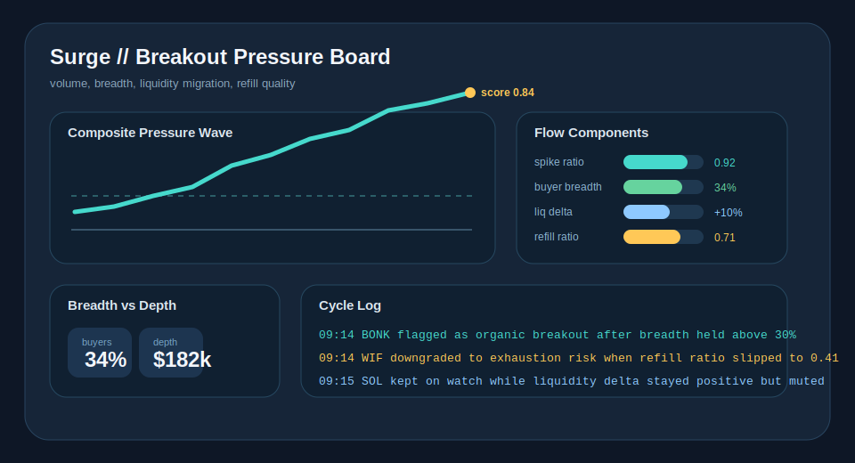

# Surge

Breakout-pressure engine for Solana tokens.

Find the Solana breakouts that still look tradable after the first sweep.

`bun run dev`

- watches buyer breadth, liquidity migration, refill quality, and venue concentration
- ignores one-wallet spikes and thin one-venue squeezes
- promotes setups that still have exitable depth after the initial burst

[](https://github.com/SurgeDetect/Surge/actions)


## Breakout Board



## Live Ticket


## Operating Surfaces

- `Breakout Board`: ranks candidates by pressure quality instead of raw volume
- `Flow Components`: exposes the inputs driving the breakout score
- `Cycle Log`: shows why a name stayed eligible, moved to watch, or fell out
- `Terminal Ticket`: prints the exact setup the operator sees in the scan

## Why Surge Exists

Most meme scanners fire on raw volume. That is the easy part. The useful distinction is whether the spike is broad enough and liquid enough to keep moving after the first burst.

Surge ranks each candidate with a continuation model:

`breakoutScore = 0.34 * spike + 0.24 * breadth + 0.22 * liquidity + 0.20 * refill - 0.18 * concentrationPenalty`

Signals are rejected when any of these fail:
- `buyerBreadthPct < MIN_BUYER_BREADTH_PCT`
- `liquidityDeltaPct < MIN_LIQUIDITY_DELTA_PCT`
- `refillRatio < MIN_REFILL_RATIO`
- `dexDominancePct > MAX_DEX_DOMINANCE_PCT`

## What Surge Looks For

The strongest Surge setup does not just print volume. It broadens. You want fresh takers, a book that keeps refilling, and enough depth growth that the move still looks tradeable after the first chase candle.

That is why Surge cares about participation quality more than dramatic candles. A break that only lives on one venue or one wallet cluster is usually too fragile to promote.

## Signal Ladder

Surge pushes names through four practical states:

- `scan`: the name is active, but the move still needs confirmation
- `watch`: the move is real enough to track, but one component is still weak
- `promote`: breadth, refill, and depth all support continuation
- `reject`: the move is too concentrated, too thin, or too late

The operator is supposed to see where the move is failing, not just whether the score is high.

## Technical Spec

### Inputs

- `spikeRatio`: current routed volume divided by the rolling baseline
- `buyerBreadthPct`: share of buying flow coming from many small and medium takers instead of one pocket
- `liquidityDeltaPct`: change in exitable top-of-book depth during the move
- `refillRatio`: how much of the consumed book refills after each sweep
- `dexDominancePct`: how concentrated the move is on a single venue

### Design Rationale

- High `spikeRatio` without breadth is usually a one-pocket move.
- Positive `liquidityDeltaPct` means the market is still willing to make the pair.
- Strong `refillRatio` reduces late-entry fragility.
- High `dexDominancePct` increases manipulation risk and lowers continuation odds.

### Signal Types

- `organic_breakout`: broad demand with healthy refill and growing depth
- `rotational_bid`: real inflow, but more sector rotation than full breakout participation
- `spoofed_surge`: concentrated or thin move that looks optically large
- `exhaustion_risk`: strong move, but refill quality is fading into the push

## Quick Start

```bash
git clone https://github.com/SurgeDetect/Surge
cd Surge
npm install
cp .env.example .env
npm run dev
```

## Configuration

```bash
ANTHROPIC_API_KEY=sk-ant-...
SPIKE_THRESHOLD=2.8
MIN_VOLUME_USD=80000
MIN_BUYER_BREADTH_PCT=24
MIN_LIQUIDITY_DELTA_PCT=6
MIN_REFILL_RATIO=0.55
MAX_DEX_DOMINANCE_PCT=82
SCAN_INTERVAL_MS=60000
```

## Why Traders Keep It Open

Surge is meant to be glanced at during noisy conditions. The board gives one clean question: if this move extends, will there still be enough market left to exit?

That framing matters more than raw breakout excitement. A lot of meme flow looks explosive for one minute and untradeable the next. Surge exists to cut that out.

## Local Audit Docs

- [Commit sequence](docs/commit-sequence.md)
- [Issue drafts](docs/issue-drafts.md)

## Support Docs

- [Runbook](docs/runbook.md)
- [Changelog](CHANGELOG.md)
- [Contributing](CONTRIBUTING.md)
- [Security](SECURITY.md)

## License

MIT
